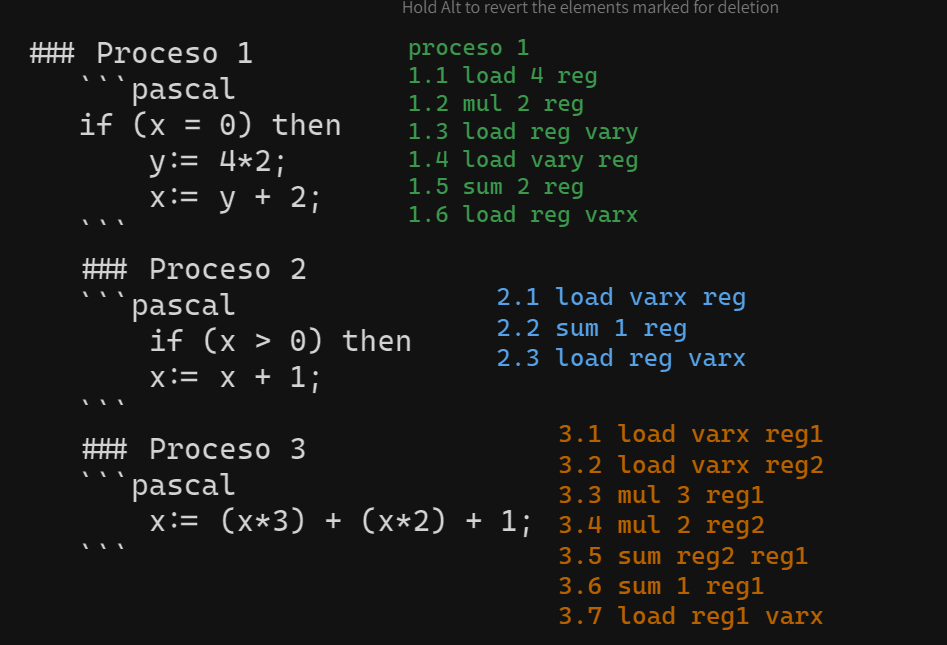

# Práctica 1 – Variables compartidas

1.  Para el siguiente programa concurrente suponga que todas las variables están inicializadas en 
    0 antes de empezar. Indique cual/es de las siguientes opciones son verdaderas: 
        a) En algún caso el valor de x al terminar el programa es 56. 
        b) En algún caso el valor de x al terminar el programa es 22. 
        c) En algún caso el valor de x al terminar el programa es 23.
    ### Proceso 1
    ```pascal
    if (x = 0) then
        y:= 4*2;
        x:= y + 2;
    ```
    ### Proceso 2
    ```pascal
        if (x > 0) then
        x:= x + 1;
    ```
    ### Proceso 3
    ```pascal
        x:= (x*3) + (x*2) + 1;
    ```
## RESPUESTA
     
    a) Verdadero.
       Se realiza primero toda la ejcución del proceso 1, luego todo el proceso 2 y por último todo el proceso 3. 
    b) Verdadero. 
       3.1 1.1 1.2 1.3 1.4 1.5 3.2 3.3 3.4 3.5 3.6 3.7 2.1 2.2 2.3
    c) Verdadero. 
       3.1 - 1.1 - 1.2 - 1.3 - 1.4 - 1.5 - 1.6 - 2.1 - 2.2 - 2.3 - 3.2 - 3.3 - 3.4 - 3.5 - 3.6 - 3.7

2. Realice una solución concurrente de grano grueso (utilizando <> y/o <await B; S>) para el 
    siguiente problema. Dado un numero N verifique cuantas veces aparece ese número en un 
    arreglo de longitud M.  

## RESPUESTA
```c
    int numero = N; int total = 0; int arreglo[M] = ... 
    process contador[id: 0..M-1]{
        if (v[id] == numero){
            <total := total + 1;>
        }
    }
```

3. Dada la siguiente solución de grano grueso:  
    a) Indicar si el siguiente código funciona para resolver el problema de 
    Productor/Consumidor  con  un  buffer  de  tamaño  N.  En  caso  de  no  funcionar,  debe 
    hacer las modificaciones necesarias.

```c
    int cant = 0;         int pri_ocupada = 0;       int pri_vacia = 0;        int buffer[N];
    Process Productor::  
    { while (true) 
      { produce elemento 
         <await (cant < N); cant++> 
         buffer[pri_vacia] = elemento; 
         pri_vacia = (pri_vacia + 1) mod N; 
       } 
    } 

    Process Consumidor::  
    { while (true) 
      { <await (cant > 0); cant-- > 
         elemento = buffer[pri_ocupada]; 
         pri_ocupada = (pri_ocupada + 1) mod N; 
         consume elemento 
       } 
    }
```

## RESPUESTA
```c
    int cant = 0;   int pri = 0;    int pri_ocupada = 0;    int pri_vacia = 0;  int buffer[N];
    Process Productor::  
    { while (true) 
      { //produce elemento 
         <await (cant < N); cant++ 
         buffer[pri] = elemento; >
         pri = (pri + 1) mod N; 
       } 
    } 

    Process Consumidor::  
    { while (true) 
      { <await (cant > 0); cant--  
         elemento = buffer[pri]; >
         pri = (pri + 1) mod N; 
         //consume elemento 
       } 
    }
```
Se crea una nueva variable "pri", la cual es compartida por ambos procesos y representa la posición del elemnto que se guardará/consumirá. 
¿Se debería dejar las variables pri_ocupada y pri_vacia? ¿Dónde se actualiza la variable pri?